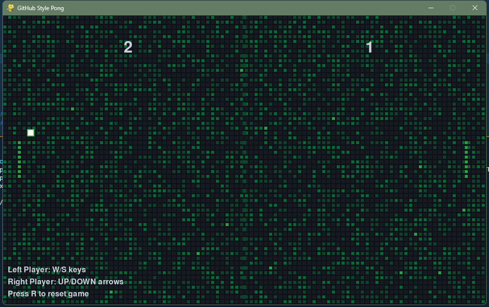

# GitHub-Style Pong Game

## Overview
A modern twist on the classic Pong game, designed with GitHub's visual aesthetic. This implementation features a contribution graph-inspired background, GitHub-style color scheme, and pixelated design elements.

## Features
- GitHub-inspired dark theme with contribution grid background
- Pixelated paddles and ball designed to resemble GitHub contribution squares
- Real-time physics with ball bouncing and paddle collisions
- Score tracking system
- Visual effects that light up the contribution grid on collisions and scoring
- Two-player controls (W/S keys vs. UP/DOWN arrows)

## Requirements

### Python Version
- Python 3.6 or higher

### Dependencies
- pygame==2.5.2

### Installation
1. Ensure Python is installed on your system
2. Install the required dependency:
